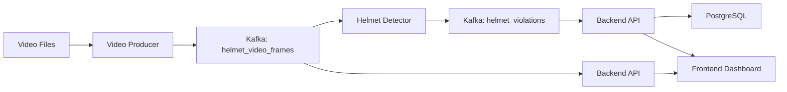

# Quick Start Guide - Helmet Violation Detection System

## 📋 Prerequisites

Ensure you have:

- ✅ Docker and Docker Compose installed
- ✅ Video files in `data/video/` directory (e.g., `bike-test.mp4`)
- ✅ YOLO models in `models/` directory:
  - `yolov3-helmet.cfg`
  - `yolov3-helmet.weights`
  - `helmet.names`
  - `yolov8n.pt`

## 🏗️ Architecture Overview



## 🚀 Quick Start (3 Steps)

### Step 1: Start the System

```bash
# From the project root directory
docker-compose up -d
```

This will start:

- ✅ Kafka & Zookeeper (Message Queue)
- ✅ PostgreSQL (Database)
- ✅ Airflow (Workflow Orchestration)
- ✅ Backend API (FastAPI + WebSocket)
- ✅ Frontend Dashboard (Next.js)

### Step 2: Access Airflow & Trigger DAG

Open Airflow UI: **http://localhost:8080**

Credentials: `airflow` / `airflow`

1. Navigate to DAGs page
2. Find `helmet_demo_streaming` DAG
3. Enable the DAG (toggle switch)
4. Click the play button (▶️) to trigger

This DAG will:

- Stream all videos from `data/video/` in parallel
- Run helmet detection on frames
- Save violations to database
- Stream live video to dashboard

### Step 3: Open the Dashboard

Open your browser and navigate to: **http://localhost:3002**

You should see:

- 📊 Statistics dashboard (total violations, today, last hour)
- 📁 Available video sources list
- 📹 Live camera view with multi-camera selection
- 🚫 Real-time violation updates

## 📁 Adding Video Sources

Place video files in `data/video/`:

```
data/video/
├── bike-test.mp4        → Camera ID: "bike-test"
├── 7356097829858.mp4    → Camera ID: "7356097829858"
└── street-cam.avi       → Camera ID: "street-cam"
```

Supported formats: `.mp4`, `.avi`, `.mkv`, `.mov`

The system will automatically detect and stream all videos in parallel.

## 🔍 Monitoring

### View Logs

```bash
# All services
docker-compose logs -f

# Specific services
docker-compose logs -f traffic-backend
docker-compose logs -f airflow-worker
```

### Check Database

```bash
# Connect to PostgreSQL
docker exec -it cardiac_prediction-postgres-1 psql -U airflow -d traffic_monitoring

# Query violations
SELECT COUNT(*) FROM helmet_violations;
SELECT * FROM helmet_violations ORDER BY timestamp DESC LIMIT 5;
```

### Test API

```bash
# Get statistics
curl http://localhost:8000/api/stats

# Get violations
curl http://localhost:8000/api/violations?limit=10

# Get available videos
curl http://localhost:8000/api/videos

# Get active cameras
curl http://localhost:8000/api/cameras
```

## 🎯 Key URLs

| Service         | URL                        | Description             |
| --------------- | -------------------------- | ----------------------- |
| **Dashboard**   | http://localhost:3002      | Real-time monitoring UI |
| **Backend API** | http://localhost:8000      | REST API & WebSocket    |
| **API Docs**    | http://localhost:8000/docs | FastAPI Swagger UI      |
| **Airflow**     | http://localhost:8080      | DAG management          |
| **Kafka**       | localhost:9092             | Message broker          |
| **PostgreSQL**  | localhost:5432             | Database                |

## 📊 Available DAGs

| DAG Name                           | Description                                                |
| ---------------------------------- | ---------------------------------------------------------- |
| `helmet_demo_streaming`            | **Demo DAG** - Producer & Detector run in parallel         |
| `helmet_violation_pipeline`        | **Full pipeline** - Sequential workflow with health checks |
| `traffic_monitoring_full_pipeline` | Traffic violation detection (YOLO + Spark)                 |

## 🛑 Stop the System

```bash
# Stop all services
docker-compose down

# Stop and remove volumes (reset database)
docker-compose down -v
```

## 🐛 Troubleshooting

### No violations detected?

- Check video files exist: `ls -la data/video/`
- Check models exist: `ls -la models/*.weights models/*.pt`
- View Airflow task logs in UI

### Dashboard not updating?

- Check WebSocket connection status (should be green)
- Check backend logs: `docker-compose logs traffic-backend`
- Ensure DAG is running in Airflow

### API returns empty video list?

- Restart backend: `docker-compose restart traffic-backend`
- Check volume mount in docker-compose.yaml

## 💡 Configuration

| Environment Variable | Default         | Description                   |
| -------------------- | --------------- | ----------------------------- |
| `TARGET_FPS`         | 7               | Streaming frame rate          |
| `STREAM_DURATION`    | 120             | DAG stream duration (seconds) |
| `VIDEO_DIR`          | /app/data/video | Video source directory        |
| `LOOP_VIDEO`         | false           | Loop videos continuously      |

## 📚 Documentation

- [README.md](README.md) - Full project documentation
- [PROJECT_ROADMAP.md](PROJECT_ROADMAP.md) - Development roadmap
- [API Docs](http://localhost:8000/docs) - Interactive API documentation
