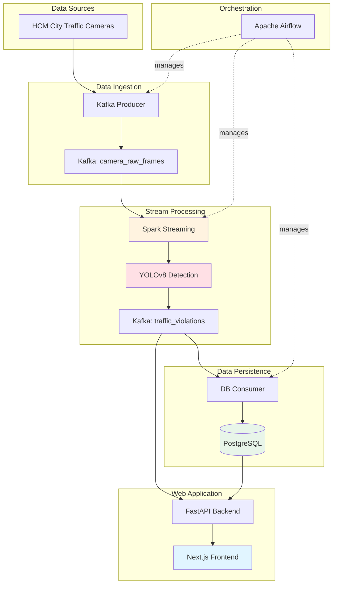

# Real-Time Traffic Violation Monitoring System

A comprehensive real-time traffic violation detection and monitoring system built with modern data engineering technologies including Apache Airflow, Apache Spark, Kafka, FastAPI, Next.js, and YOLOv8.

## 🎯 Overview

This system automates the detection and monitoring of traffic violations using AI-powered computer vision. It processes live camera feeds from Ho Chi Minh City traffic cameras, detects violations using YOLOv8 object detection, and provides real-time monitoring through a modern web dashboard.

### Key Features

- ✅ **Real-time Processing**: Live streaming pipeline with Kafka and Spark
- 🤖 **AI-Powered Detection**: YOLOv8 for vehicle and traffic light detection
- 📊 **Live Dashboard**: Real-time Next.js frontend with WebSocket updates
- 🔄 **Orchestrated Workflows**: Airflow DAG for pipeline management
- 💾 **Persistent Storage**: PostgreSQL database with time-series analytics
- 🐳 **Containerized**: Full Docker Compose setup for easy deployment

## 🏗️ Architecture



## 📁 Project Structure

```
cardiac_prediction/
├── apps/
│   ├── backend/                    # FastAPI backend service
│   │   ├── main.py                # WebSocket + REST API
│   │   ├── config.py              # Centralized configuration
│   │   ├── services/              # Business logic modules
│   │   │   ├── database.py        # PostgreSQL operations
│   │   │   └── video.py           # Video file operations
│   │   ├── routers/               # API route handlers
│   │   │   └── videos.py          # Video endpoints
│   │   ├── Dockerfile
│   │   └── requirements.txt
│   └── frontend/                   # Next.js frontend application
│       ├── src/
│       │   ├── app/
│       │   │   ├── page.tsx       # Main dashboard
│       │   │   └── page.module.css
│       │   ├── components/        # Reusable UI components
│       │   │   ├── CameraViewer/  # Multi-camera live view
│       │   │   ├── StatsCard/     # Statistics display
│       │   │   ├── ViolationCard/ # Violation display
│       │   │   └── VideoSourceList/ # Available videos
│       │   └── types/             # TypeScript interfaces
│       ├── Dockerfile
│       └── package.json
├── pipeline/
│   ├── detectors/                  # 🆕 Shared detection logic
│   │   ├── __init__.py
│   │   ├── base.py                # Utilities: box, drawing, config
│   │   ├── tracker.py             # CentroidTracker class
│   │   ├── redlight_detector.py   # Red light detection logic
│   │   └── helmet_detector.py     # Helmet detection logic
│   ├── producers/
│   │   ├── kafka_producer.py      # Camera feed ingestion
│   │   └── video_producer.py      # Multi-video parallel streaming
│   ├── processors/
│   │   └── spark_processor.py     # Spark + YOLO detection
│   └── consumers/
│       ├── db_consumer.py         # PostgreSQL writer
│       ├── helmet_detector_consumer.py   # Helmet violation (Kafka)
│       └── redlight_detector_consumer.py # Red light violation (Kafka)
├── scripts/                        # 🆕 Standalone detection scripts
│   ├── detect_helmet_violation.py # Helmet detection (standalone)
│   ├── detect_redlight_violation.py # Red light detection (standalone)
│   └── configure_roi.py           # ROI configuration tool
├── airflow/
│   ├── dags/
│   │   ├── traffic_monitoring_dag.py    # Traffic violation DAG
│   │   ├── helmet_violation_dag.py      # Helmet detection (sequential)
│   │   └── helmet_demo_dag.py           # Violation demo (parallel)
│   └── config/
│       ├── init_database.sql
│       ├── init_traffic_monitoring.sql
│       ├── init_helmet_violations.sql
│       └── init_redlight_violations.sql
├── config/
│   └── roi_config.json            # 🆕 Camera ROI configurations
├── data/
│   └── video/                     # Video source files
├── models/                        # YOLO model files
│   ├── yolov3-helmet.cfg
│   ├── yolov3-helmet.weights
│   └── yolov8n.pt
├── docker/
│   ├── Dockerfile                 # Producer image
│   └── base/
│       └── Dockerfile             # Airflow custom image
├── docker-compose.yaml            # Full stack orchestration
├── QUICKSTART.md                  # Quick start guide
├── PROJECT_ROADMAP.md             # Development roadmap
└── README.md
```

## 🔄 Data Flow

### 1. Data Collection (`kafka_producer.py`)

**Function**: Fetch images from HCM City traffic camera API

**Output**: Kafka messages to `camera_raw_frames` topic

```json
{
  "camera_id": "pasteur_le_duan",
  "timestamp": "2025-12-15T23:28:00.123456",
  "image_path": "/app/images/pasteur_le_duan/frame_20251215_232800.jpg",
  "filename": "frame_20251215_232800.jpg"
}
```

### 2. AI Detection (`spark_processor.py`)

**Function**: Real-time violation detection using Spark Streaming + YOLOv8

**Process**:

1. Consume from `camera_raw_frames`
2. Load image and run YOLO detection
3. Detect vehicles (car, motorcycle, bus, truck)
4. Detect traffic lights
5. Apply violation logic based on ROI configuration
6. Output violations to `traffic_violations` topic

**Violation Types**:

- `stop_line_crossing`: Vehicle crosses stop line
- `red_light_running`: Vehicle crosses during red light

**Output**: Kafka messages to `traffic_violations` topic

```json
{
  "camera_id": "pasteur_le_duan",
  "timestamp": "2025-12-15T23:28:01.456789",
  "image_path": "/app/images/pasteur_le_duan/frame_20251215_232800.jpg",
  "violations": [
    {
      "type": "stop_line_crossing",
      "vehicle": "car",
      "confidence": 0.89,
      "traffic_light_state": "RED",
      "position": [250.5, 325.4]
    }
  ]
}
```

### 3. Data Persistence (`db_consumer.py`)

**Function**: Store violations in PostgreSQL with batch processing

**Database Schema**:

```sql
-- Violations table
CREATE TABLE traffic_violations (
    id SERIAL PRIMARY KEY,
    camera_id VARCHAR(100),
    violation_type VARCHAR(100),
    vehicle_type VARCHAR(50),
    confidence FLOAT,
    position_x FLOAT,
    position_y FLOAT,
    traffic_light_state VARCHAR(20),
    image_path VARCHAR(500),
    detected_at TIMESTAMP,
    created_at TIMESTAMP DEFAULT CURRENT_TIMESTAMP
);

-- Camera metadata
CREATE TABLE cameras (
    id SERIAL PRIMARY KEY,
    camera_id VARCHAR(100) UNIQUE,
    name VARCHAR(255),
    location VARCHAR(500),
    is_active BOOLEAN DEFAULT TRUE
);
```

### 4. Web Application

#### Backend (`apps/backend/main.py`)

**Technology**: FastAPI with WebSocket support

**Endpoints**:

- `GET /`: Health check
- `GET /violations`: Latest 50 violations
- `WebSocket /ws`: Real-time violation stream

#### Frontend (`apps/frontend/src/app/page.tsx`)

**Technology**: Next.js 16 with App Router

**Features**:

- Real-time violation feed via WebSocket
- Live statistics (total violations, active cameras)
- Visual violation cards with metadata
- Responsive dark theme UI

**Access**: http://localhost:3000

## 🚀 Quick Start

### Prerequisites

- Docker Desktop installed
- At least 8GB RAM available
- 10GB free disk space

### 1. Start All Services

```bash
cd c:\Users\LENOVO\Desktop\cardiac_prediction
docker compose up -d --build
```

**Services Started**:

- Kafka & Zookeeper
- PostgreSQL
- Airflow (webserver, scheduler, worker, triggerer)
- FastAPI Backend
- Next.js Frontend
- Traffic Producer

### 2. Access Airflow

**URL**: http://localhost:8080

**Credentials**: `airflow` / `airflow`

**DAG**: `traffic_monitoring_full_pipeline`

### 3. Trigger the Pipeline

1. Navigate to DAGs page in Airflow
2. Find `traffic_monitoring_full_pipeline`
3. Click the play button (▶️) to trigger
4. Monitor task execution in Graph or Grid view

### 4. View Dashboard

**URL**: http://localhost:3000

The dashboard will display:

- Live violation alerts
- Session statistics
- Active camera count
- Real-time updates via WebSocket

## 🔧 Configuration

### Camera ROI Configuration (`config/roi.json`)

Define regions of interest for each camera:

```json
{
  "pasteur_le_duan": {
    "stop_line": [
      [100, 300],
      [500, 300]
    ],
    "traffic_light_roi": [400, 50, 450, 100]
  }
}
```

### Camera Metadata (`config/cameras.json`)

```json
[
  {
    "camera_id": "pasteur_le_duan",
    "name": "Ngã tư Pasteur - Lê Duẩn",
    "location": "District 1, HCMC",
    "api_url": "https://giaothong.hochiminhcity.gov.vn/..."
  }
]
```

## 📊 Monitoring

### Kafka Topics

```bash
# List all topics
docker compose exec kafka kafka-topics --bootstrap-server localhost:9092 --list

# Monitor camera frames
docker compose exec kafka kafka-console-consumer \
  --bootstrap-server localhost:9092 \
  --topic camera_raw_frames

# Monitor violations
docker compose exec kafka kafka-console-consumer \
  --bootstrap-server localhost:9092 \
  --topic traffic_violations
```

### Database Queries

```bash
# Connect to PostgreSQL
docker compose exec postgres psql -U airflow -d traffic_monitoring

# Check violation count
SELECT COUNT(*) FROM traffic_violations;

# Violations by camera
SELECT camera_id, COUNT(*) as total
FROM traffic_violations
GROUP BY camera_id
ORDER BY total DESC;
```

### View Logs

```bash
# Backend logs
docker compose logs -f traffic-backend

# Producer logs
docker compose logs -f traffic-monitoring-producer

# Airflow worker logs
docker compose logs -f airflow-worker
```

## 🛠️ Development

### Hot Reload Setup

**Frontend**: Volume-mounted with `npm run dev` for instant updates

**Backend**: Volume-mounted with `uvicorn --reload` for auto-restart

### Rebuild Containers

```bash
# Rebuild specific service
docker compose up -d --build traffic-frontend

# Rebuild all services
docker compose up -d --build
```

### Access Container Shell

```bash
# Airflow worker (for debugging pipeline)
docker compose exec airflow-worker bash

# Producer container
docker compose exec traffic-monitoring-producer bash
```

## 📈 Performance Metrics

| Component        | Throughput               | Latency         |
| ---------------- | ------------------------ | --------------- |
| Kafka Producer   | 4 cameras @ 10s interval | ~1s per image   |
| Spark Processing | Micro-batch every 5s     | ~2-3s per batch |
| YOLO Inference   | ~30 FPS (CPU)            | ~30ms per frame |
| DB Consumer      | Batch of 10 messages     | ~50ms           |
| WebSocket        | Real-time                | < 100ms         |

## 🔮 Future Enhancements

### Phase 1: Advanced Detection

- [x] Red light violation with traffic light state detection
- [x] Helmet violation detection
- [x] Detection zone (quadrilateral) for accurate lane filtering
- [x] Configurable violation direction (above/below stop line)
- [ ] License plate recognition (OCR)
- [ ] Speed estimation
- [x] Vehicle tracking across frames (CentroidTracker)

### Phase 2: Scalability

- [ ] Multi-worker Spark cluster
- [ ] Kafka topic partitioning by camera
- [ ] Redis caching for API
- [ ] CDN for static assets

### Phase 3: Integration

- [ ] Email/SMS alerts
- [ ] Mobile app (React Native)
- [ ] Admin panel for configuration
- [ ] Export violation reports (PDF/Excel)

## 🛡️ Troubleshooting

### Build Issues

**Problem**: Cache lock errors during build

**Solution**: Already configured with `sharing=locked` in Dockerfiles

### Producer Not Sending Messages

```bash
# Check producer logs
docker compose logs -f traffic-monitoring-producer

# Verify Kafka connectivity
docker compose exec kafka kafka-broker-api-versions --bootstrap-server localhost:9092
```

### Frontend Not Updating

1. Check WebSocket connection in browser DevTools
2. Verify backend is running: `curl http://localhost:8000/violations`
3. Check browser console for errors

### Spark Job Failing

```bash
# Check YOLO model exists
docker compose exec airflow-worker ls -lh /opt/airflow/projects/realtime-traffic-monitoring/yolov8n.pt

# View Spark logs
docker compose logs airflow-worker | grep -i spark
```

## 💻 Tech Stack

| Category          | Technology           | Version    |
| ----------------- | -------------------- | ---------- |
| Orchestration     | Apache Airflow       | 2.9.0      |
| Stream Processing | Apache Spark         | 3.5.1      |
| Message Queue     | Apache Kafka         | 7.5.0      |
| Database          | PostgreSQL           | 13         |
| Backend           | FastAPI              | Latest     |
| Frontend          | Next.js              | 16.0.10    |
| AI/ML             | YOLOv8 (Ultralytics) | 8.x        |
| Language          | Python               | 3.9 / 3.12 |
| Runtime           | Node.js              | 22         |
| Containerization  | Docker Compose       | Latest     |

## 📄 License

MIT License - feel free to use for educational purposes.

## 👤 Author

**Nguyen Cong Tu** - Initial development and implementation

---

**Note**: This system is designed for educational and demonstration purposes. For production deployment, additional security, monitoring, and scalability measures should be implemented.
