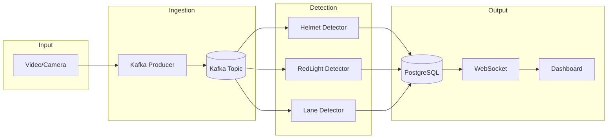
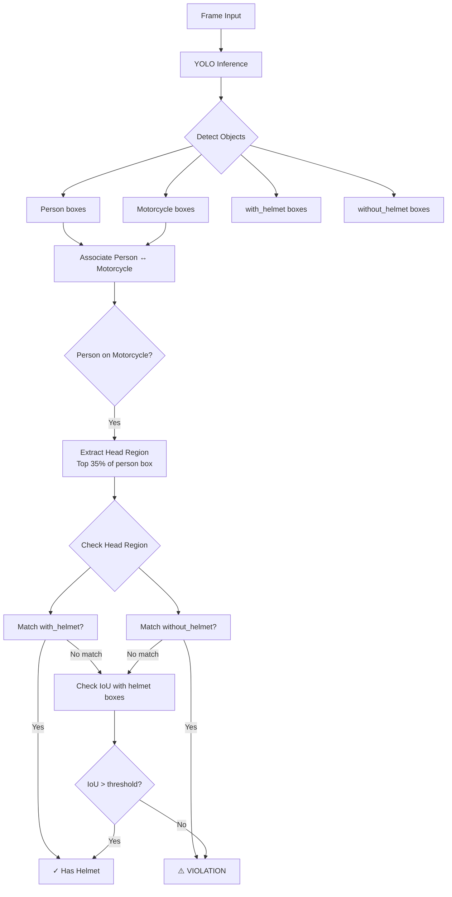
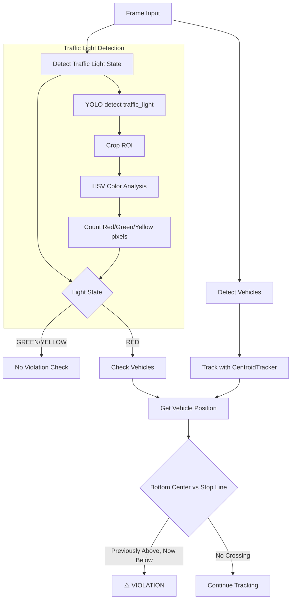
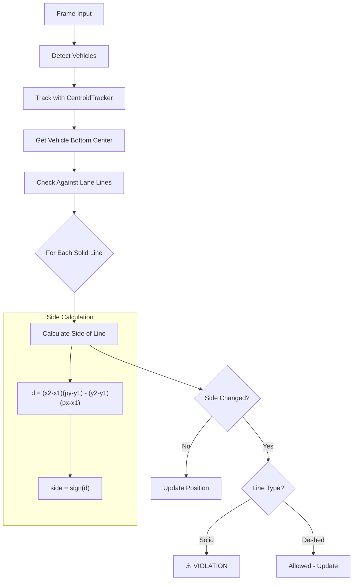
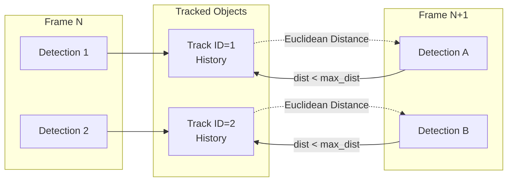

# Báo Cáo Hệ Thống Phát Hiện Vi Phạm Giao Thông Thời Gian Thực

## 1. Tổng Quan Hệ Thống

Hệ thống sử dụng **YOLOv8** kết hợp với **Apache Kafka** để phát hiện vi phạm giao thông real-time từ camera giám sát.

### Các Loại Vi Phạm Được Phát Hiện

| Vi phạm               | Model               | Logic                              |
| --------------------- | ------------------- | ---------------------------------- |
| Không đội mũ bảo hiểm | best.pt (8 classes) | Person + Motorcycle + No Helmet    |
| Vượt đèn đỏ           | yolov8n.pt          | Vehicle crosses stop line when RED |
| Lấn làn               | yolov8n.pt          | Vehicle crosses solid lane line    |

---

## 2. Kiến Trúc Pipeline



---

## 3. Luồng Phát Hiện Vi Phạm Mũ Bảo Hiểm

**Model**: `best.pt` - Unified model với 8 classes



### Logic Chính

```python
# Pseudo-code
if person.on_motorcycle:
    head_region = person.box.top_35_percent()
    if head_region.overlaps(without_helmet_box):
        return VIOLATION
    if not head_region.overlaps(with_helmet_box):
        return VIOLATION
```

---

## 4. Luồng Phát Hiện Vượt Đèn Đỏ

**Model**: `yolov8n.pt` - COCO pretrained



### Cấu Hình ROI

```json
{
  "stop_line": { "y": 646, "violation_direction": "above" },
  "traffic_light_roi": { "x1": 28, "y1": 9, "x2": 184, "y2": 190 },
  "detection_zone": [
    [640, 406],
    [1167, 410],
    [1899, 1014],
    [52, 1018]
  ]
}
```

---

## 5. Luồng Phát Hiện Lấn Làn

**Model**: `yolov8n.pt` + Image Processing



### Công Thức Tính Khoảng Cách Điểm-Đường

$$d = \frac{|(x_2-x_1)(y_1-y_p) - (x_1-x_p)(y_2-y_1)|}{\sqrt{(x_2-x_1)^2 + (y_2-y_1)^2}}$$

---

## 6. Object Tracking: CentroidTracker



**Thuật toán**: Hungarian Assignment với Euclidean Distance

---

## 7. Tech Stack

| Layer         | Technology           |
| ------------- | -------------------- |
| AI Model      | YOLOv8 (Ultralytics) |
| Message Queue | Apache Kafka         |
| Orchestration | Apache Airflow       |
| Database      | PostgreSQL           |
| Backend       | FastAPI + WebSocket  |
| Frontend      | Next.js              |

---

## 8. Hiệu Suất

| Metric             | Value         |
| ------------------ | ------------- |
| Inference Speed    | ~30 FPS (CPU) |
| End-to-End Latency | < 500ms       |
| Detection Accuracy | ~85% mAP@0.5  |

---

## 9. Hạn Chế & Hướng Phát Triển

- **Hiện tại**: Phụ thuộc vào góc camera cố định, cần cấu hình ROI thủ công
- **Tương lai**:
  - OCR nhận dạng biển số
  - Ước lượng tốc độ
  - GPU acceleration với TensorRT
