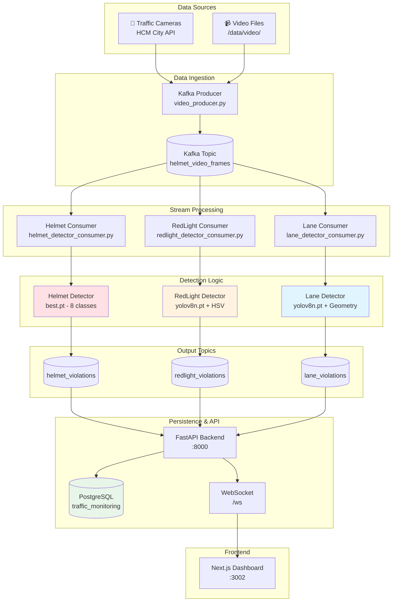
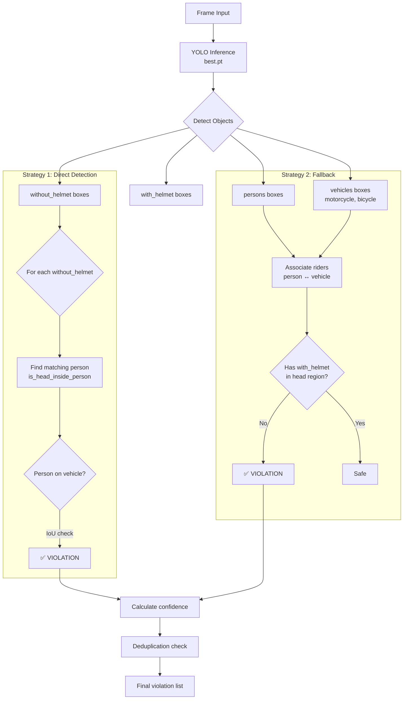
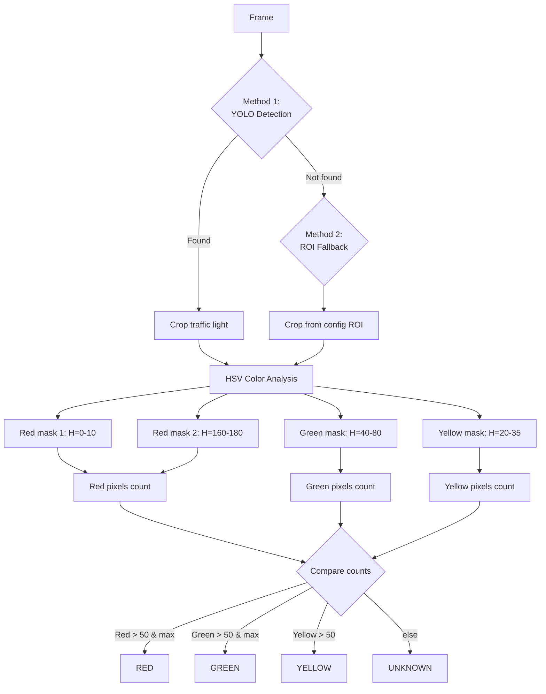
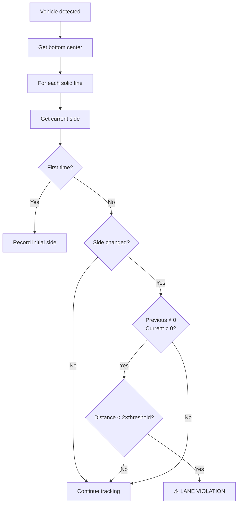
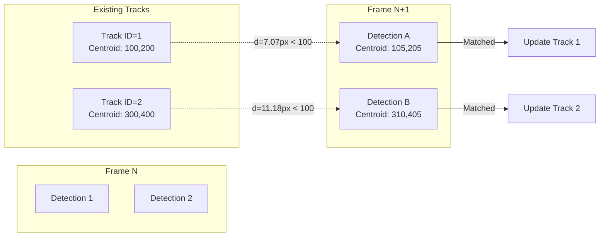
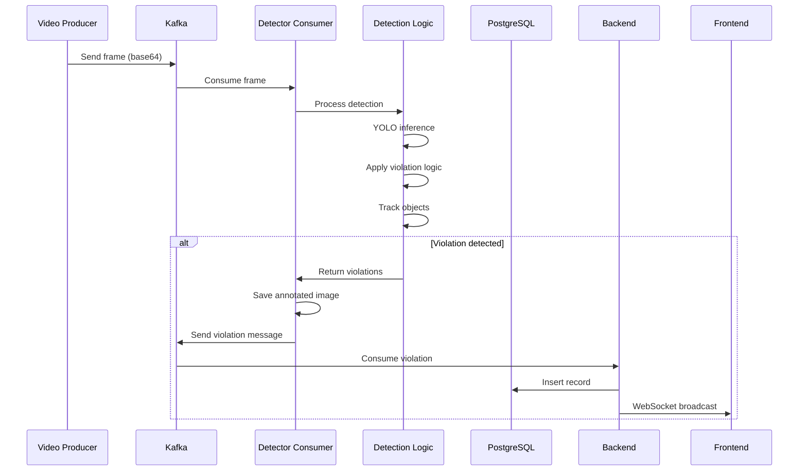

# BÁO CÁO KỸ THUẬT CHI TIẾT

## Hệ Thống Phát Hiện Vi Phạm Giao Thông Thời Gian Thực

---

## MỤC LỤC

1. [Tổng Quan Dự Án](#1-tổng-quan-dự-án)
2. [Kiến Trúc Hệ Thống](#2-kiến-trúc-hệ-thống)
3. [Các Thành Phần Chi Tiết](#3-các-thành-phần-chi-tiết)
4. [Thuật Toán Phát Hiện Vi Phạm](#4-thuật-toán-phát-hiện-vi-phạm)
5. [Object Tracking](#5-object-tracking)
6. [Data Pipeline](#6-data-pipeline)
7. [Cơ Sở Dữ Liệu](#7-cơ-sở-dữ-liệu)
8. [Cấu Hình ROI](#8-cấu-hình-roi)
9. [Web Application](#9-web-application)
10. [Hiệu Suất và Đánh Giá](#10-hiệu-suất-và-đánh-giá)
11. [Hạn Chế và Hướng Phát Triển](#11-hạn-chế-và-hướng-phát-triển)

---

## 1. Tổng Quan Dự Án

### 1.1 Mục Tiêu

Hệ thống được thiết kế để phát hiện và giám sát vi phạm giao thông **thời gian thực** từ camera giám sát, sử dụng các công nghệ hiện đại bao gồm:

- **AI/ML**: YOLOv8 (Ultralytics) cho object detection
- **Message Queue**: Apache Kafka cho xử lý stream
- **Orchestration**: Apache Airflow cho quản lý pipeline
- **Database**: PostgreSQL cho lưu trữ dữ liệu
- **Backend**: FastAPI với WebSocket
- **Frontend**: Next.js với real-time updates

### 1.2 Các Loại Vi Phạm Được Phát Hiện

| Vi Phạm                   | Model                 | Phương Pháp                                 |
| ------------------------- | --------------------- | ------------------------------------------- |
| **Không đội mũ bảo hiểm** | `best.pt` (8 classes) | Person + Motorcycle + No Helmet detection   |
| **Vượt đèn đỏ**           | `yolov8n.pt`          | Vehicle crosses stop line when light is RED |
| **Lấn làn**               | `yolov8n.pt`          | Vehicle crosses solid lane line             |

### 1.3 Cấu Trúc Thư Mục Dự Án

```
cardiac_prediction/
├── apps/
│   ├── backend/                    # FastAPI backend service
│   │   ├── main.py                 # WebSocket + REST API (787 lines)
│   │   ├── config.py               # Centralized configuration
│   │   ├── services/               # Business logic modules
│   │   └── routers/                # API route handlers
│   └── frontend/                    # Next.js frontend application
│       └── src/
│           ├── app/                # Pages & routing
│           └── components/         # UI components
├── pipeline/
│   ├── detectors/                   # Shared detection logic
│   │   ├── base.py                 # Utilities (203 lines)
│   │   ├── tracker.py              # CentroidTracker (104 lines)
│   │   ├── redlight_detector.py    # Red light logic (299 lines)
│   │   ├── helmet_detector.py      # Helmet logic (538 lines)
│   │   └── lane_detector.py        # Lane logic (339 lines)
│   ├── producers/                   # Kafka producers
│   │   ├── kafka_producer.py       # Camera feed ingestion
│   │   └── video_producer.py       # Multi-video streaming (224 lines)
│   └── consumers/                   # Kafka consumers
│       ├── db_consumer.py          # PostgreSQL writer
│       ├── helmet_detector_consumer.py
│       ├── redlight_detector_consumer.py
│       └── lane_detector_consumer.py
├── scripts/                         # Standalone detection scripts
│   ├── detect_helmet_violation.py
│   ├── detect_redlight_violation.py
│   ├── detect_lane_violation.py
│   └── configure_roi.py            # ROI configuration tool
├── airflow/
│   ├── dags/                        # Airflow DAGs
│   └── config/                      # Database init scripts
├── config/
│   └── roi_config.json              # Camera ROI configurations
├── models/                          # YOLO model files
│   ├── best.pt                     # Unified helmet model (8 classes)
│   └── yolov8n.pt                  # General object detection
└── docker-compose.yaml              # Full stack orchestration
```

---

## 2. Kiến Trúc Hệ Thống

### 2.1 Sơ Đồ Kiến Trúc Tổng Quan



### 2.2 Docker Services

Hệ thống được container hóa hoàn toàn với các services:

| Service             | Image                       | Port | Chức Năng          |
| ------------------- | --------------------------- | ---- | ------------------ |
| `postgres`          | postgres:13                 | 5432 | Database chính     |
| `redis`             | redis:8.2.2                 | 6379 | Celery broker      |
| `kafka`             | confluentinc/cp-kafka:7.5.0 | 9092 | Message queue      |
| `zookeeper`         | zookeeper:3.8               | 2181 | Kafka coordination |
| `airflow-webserver` | custom:2.9.0                | 8080 | Airflow UI         |
| `airflow-scheduler` | custom:2.9.0                | -    | Task scheduling    |
| `airflow-worker`    | custom:2.9.0                | -    | Task execution     |
| `traffic-backend`   | custom                      | 8000 | FastAPI backend    |
| `traffic-frontend`  | custom                      | 3002 | Next.js frontend   |

---

## 3. Các Thành Phần Chi Tiết

### 3.1 Base Utilities (`pipeline/detectors/base.py`)

Module này cung cấp các utility functions dùng chung cho tất cả detectors:

#### 3.1.1 Box Utilities

```python
def clamp_box(box: List[int], W: int, H: int) -> List[int]:
    """Giới hạn box [x, y, w, h] trong ranh giới ảnh"""

def box_xyxy(box: List[int]) -> Tuple[int, int, int, int]:
    """Chuyển [x, y, w, h] sang (x1, y1, x2, y2)"""

def centroid(box: List[int]) -> Tuple[float, float]:
    """Lấy tâm điểm của box"""

def bottom_center(box: List[int]) -> Tuple[float, float]:
    """Lấy điểm giữa đáy box (dùng cho stop line crossing)"""

def iou(a: List[int], b: List[int]) -> float:
    """Tính Intersection over Union giữa 2 boxes"""

def point_in_polygon(point, polygon) -> bool:
    """Ray casting algorithm để kiểm tra điểm trong polygon"""
```

#### 3.1.2 Drawing Utilities

```python
def draw_box(img, box, label, color, thickness)
def draw_stop_line(img, y_pos, color, thickness)
def draw_detection_zone(img, zone, color, thickness)
```

#### 3.1.3 Config Utilities

```python
def load_roi_config(config_path) -> Dict:
    """Load ROI config từ JSON file"""

def get_camera_config(all_config, camera_id) -> Dict:
    """Lấy config theo camera với fallback về default"""

def scale_config(config, actual_width, actual_height) -> Dict:
    """Scale ROI config theo kích thước frame thực tế"""
```

> **Điểm quan trọng**: Hàm `scale_config()` cho phép cấu hình ROI ở kích thước chuẩn (1920x1080) và tự động scale theo resolution thực tế của video/camera.

### 3.2 Video Producer (`pipeline/producers/video_producer.py`)

Producer hỗ trợ streaming nhiều video song song:

```python
# Cấu hình
KAFKA_TOPIC = 'helmet_video_frames'
TARGET_FPS = 15  # FPS mục tiêu
LOOP_VIDEO = False  # Có lặp video không

# Message format gửi đến Kafka
message = {
    "camera_id": camera_id,
    "frame_number": frame_count,
    "timestamp": datetime.now().isoformat(),
    "image_base64": base64_encoded_frame,
    "width": frame.shape[1],
    "height": frame.shape[0]
}
```

**Đặc điểm**:

- Hỗ trợ multi-threading cho nhiều video đồng thời
- Tự động resize frame > 720p để tiết kiệm bandwidth
- Compression với GZIP
- Frame skip để đạt target FPS

---

## 4. Thuật Toán Phát Hiện Vi Phạm

### 4.1 Phát Hiện Không Đội Mũ Bảo Hiểm (`helmet_detector.py`)

#### 4.1.1 Model Architecture

Sử dụng **Unified Model** (`best.pt`) với 8 classes:

| Class ID | Class Name     | Mô tả              |
| -------- | -------------- | ------------------ |
| 0        | person         | Người              |
| 1        | bicycle        | Xe đạp             |
| 2        | car            | Ô tô               |
| 3        | motorcycle     | Xe máy             |
| 4        | bus            | Xe buýt            |
| 5        | truck          | Xe tải             |
| 6        | with_helmet    | Người đội mũ       |
| 7        | without_helmet | Người không đội mũ |

#### 4.1.2 Detection Strategy



#### 4.1.3 Key Functions

**1. Associate Riders (Person ↔ Vehicle)**:

```python
def associate_riders(persons: List, bikes: List) -> List[Tuple]:
    """
    Liên kết người với xe để xác định rider.
    Điều kiện:
    - Bottom center của person nằm trong vehicle box
    - HOẶC IoU(person, vehicle) >= 0.15
    Mỗi xe có thể có tối đa 3 riders.
    """
```

**2. Head Region Check**:

```python
def is_head_inside_person(head_box, person_box, head_region_ratio=0.5):
    """
    Kiểm tra head box có nằm trong vùng đầu của person không.
    - Head center x phải nằm trong person width
    - Head center y phải nằm trong 50% trên của person
    """
```

**3. Confidence Calculation**:

```python
CONFIDENCE_WEIGHT_PERSON = 0.25
CONFIDENCE_WEIGHT_VEHICLE = 0.25
CONFIDENCE_WEIGHT_NO_HELMET = 0.50

confidence = (
    person_conf * 0.25 +
    vehicle_conf * 0.25 +
    no_helmet_factor * 0.50
)
# Bonus +0.1 nếu đang trên xe
```

#### 4.1.4 Violation Deduplicator

Tránh trùng lặp khi track ID thay đổi (do occlusion):

```python
class ViolationDeduplicator:
    def __init__(self,
                 time_threshold: float = 3.0,    # Cooldown 3 giây
                 distance_threshold: float = 50  # 50 pixels
    ):

    def is_duplicate(self, track_id, person_box, current_time) -> bool:
        """
        Check duplicate bằng:
        1. Cùng track_id trong cooldown
        2. Khác track_id nhưng cùng vị trí (distance < 50px)
        """
```

### 4.2 Phát Hiện Vượt Đèn Đỏ (`redlight_detector.py`)

#### 4.2.1 Traffic Light Detection



**HSV Color Ranges**:

```python
DEFAULT_COLOR_CONFIG = {
    "red_lower1": [0, 100, 100],      # Đỏ (lower spectrum)
    "red_upper1": [10, 255, 255],
    "red_lower2": [160, 100, 100],    # Đỏ (upper spectrum)
    "red_upper2": [180, 255, 255],
    "green_lower": [40, 100, 100],
    "green_upper": [80, 255, 255],
    "yellow_lower": [20, 100, 100],
    "yellow_upper": [35, 255, 255]
}
```

#### 4.2.2 Violation Detection Logic

```python
class RedLightViolationChecker:
    def check_violation(self, track_info, light_state) -> bool:
        # Chỉ check khi đèn đỏ
        if light_state != "RED":
            return False

        # Lấy điểm đáy giữa của vehicle
        _, vehicle_y = bottom_center(track_info["box"])

        # Check theo hướng vi phạm (above/below)
        if self.violation_direction == "above":
            crossed_now = vehicle_y < self.stop_line_y
        else:
            crossed_now = vehicle_y > self.stop_line_y

        # Vi phạm = vừa vượt line (không phải đã ở bên kia từ trước)
        if crossed_now and not track_info.get("crossed", False):
            track_info["crossed"] = True
            return True

        return False
```

> **Quan trọng**: Hệ thống hỗ trợ 2 hướng vi phạm:
>
> - `"above"`: Vi phạm khi xe di chuyển từ dưới lên trên stop line
> - `"below"`: Vi phạm khi xe di chuyển từ trên xuống dưới stop line

### 4.3 Phát Hiện Lấn Làn (`lane_detector.py`)

#### 4.3.1 Lane Line Representation

```python
class LaneLine:
    def __init__(self, line_config, line_id):
        self.id = line_id
        self.x1, self.y1 = line_config["x1"], line_config["y1"]
        self.x2, self.y2 = line_config["x2"], line_config["y2"]
        self.line_type = line_config.get("type", "solid")  # solid/dashed
```

#### 4.3.2 Point-to-Line Side Calculation

Công thức xác định điểm nằm bên nào của đường thẳng:

$$d = (x_2 - x_1)(p_y - y_1) - (y_2 - y_1)(p_x - x_1)$$

- $d > 0$: Điểm nằm bên phải
- $d < 0$: Điểm nằm bên trái
- $d = 0$: Điểm nằm trên đường

```python
def get_line_side(px, py, x1, y1, x2, y2) -> int:
    """Returns: -1 (left), 0 (on line), 1 (right)"""
    d = (x2 - x1) * (py - y1) - (y2 - y1) * (px - x1)
    return 1 if d > 0 else (-1 if d < 0 else 0)
```

#### 4.3.3 Violation Detection



```python
class LaneViolationChecker:
    def check_violation(self, track_id, track_info) -> Optional[Dict]:
        # Lấy điểm đáy giữa của xe
        px, py = bottom_center(track_info["box"])

        for line in self.lane_lines:
            if not line.is_solid():
                continue  # Chỉ check solid line

            current_side = line.get_side(px, py)
            previous_side = self.vehicle_line_sides[track_id].get(line.id, 0)

            # Vi phạm = thay đổi side (không qua 0)
            if previous_side != 0 and current_side != 0:
                if previous_side != current_side:
                    return {
                        "type": "solid_line_crossing",
                        "line_id": line.id,
                        "from_side": "left" if previous_side == -1 else "right",
                        "to_side": "left" if current_side == -1 else "right"
                    }

        return None
```

---

## 5. Object Tracking

### 5.1 CentroidTracker (`pipeline/detectors/tracker.py`)

Thuật toán tracking đơn giản dựa trên khoảng cách centroid:

```python
class CentroidTracker:
    def __init__(self, max_dist=100, ttl_sec=2.0):
        """
        Args:
            max_dist: Khoảng cách tối đa (pixels) để match track
            ttl_sec: Thời gian sống của track khi không detect được
        """
        self.tracks = {}  # track_id -> track_info
        self.next_id = 1
```

### 5.2 Thuật Toán Matching



**Quy trình**:

1. Loại bỏ tracks quá TTL (2 giây không detect)
2. Với mỗi detection mới, tính Euclidean distance đến tất cả existing tracks
3. Match với track gần nhất nếu distance < max_dist (100px)
4. Nếu không match được, tạo track mới

```python
def update(self, detections, now_ts) -> Dict:
    # 1. Cleanup stale tracks
    for tid in list(self.tracks.keys()):
        if (now_ts - self.tracks[tid]["t"]) > self.ttl_sec:
            del self.tracks[tid]

    # 2. Greedy assignment
    for box, extra_info in detections:
        cx, cy = centroid(box)

        # Find nearest track
        best_id, best_dist = None, float('inf')
        for tid, tr in self.tracks.items():
            d = sqrt((cx - tr["c"][0])**2 + (cy - tr["c"][1])**2)
            if d < best_dist:
                best_dist = d
                best_id = tid

        if best_id and best_dist <= self.max_dist:
            # Update existing track
            self.tracks[best_id]["c"] = (cx, cy)
            self.tracks[best_id]["t"] = now_ts
        else:
            # Create new track
            self.tracks[self.next_id] = {
                "c": (cx, cy), "t": now_ts, "box": box, "crossed": False
            }
            self.next_id += 1
```

---

## 6. Data Pipeline

### 6.1 Kafka Topics

| Topic                 | Producer                   | Consumer      | Mô tả                      |
| --------------------- | -------------------------- | ------------- | -------------------------- |
| `helmet_video_frames` | video_producer.py          | All consumers | Raw video frames (base64)  |
| `helmet_violations`   | helmet_detector_consumer   | backend       | Helmet violations          |
| `redlight_violations` | redlight_detector_consumer | backend       | Red light violations       |
| `lane_violations`     | lane_detector_consumer     | backend       | Lane violations            |
| `traffic_violations`  | spark_processor            | backend       | General traffic violations |

### 6.2 Message Format

**Input Frame Message**:

```json
{
  "camera_id": "cam1",
  "frame_number": 1234,
  "timestamp": "2025-01-14T15:30:00.000Z",
  "image_base64": "base64_encoded_jpeg",
  "width": 1920,
  "height": 1080
}
```

**Violation Output Message**:

```json
{
  "violation_id": "uuid-string",
  "timestamp": "2025-01-14T15:30:01.000Z",
  "camera_id": "cam1",
  "violation_type": "RED_LIGHT",
  "vehicle_type": "car",
  "traffic_light_state": "RED",
  "confidence": 0.92,
  "track_id": 5,
  "frame_number": 1234,
  "bounding_box": { "x": 100, "y": 200, "w": 150, "h": 100 },
  "image_path": "/app/violations/redlight/redlight_cam1_20250114_153001_uuid.jpg",
  "image_base64": "base64_encoded_annotated_image",
  "metadata": {
    "stop_line_y": 840,
    "violation_direction": "above",
    "frame_size": [1920, 1080]
  }
}
```

### 6.3 Consumer Workflow



---

## 7. Cơ Sở Dữ Liệu

### 7.1 Schema Design

**Helmet Violations Table**:

```sql
CREATE TABLE helmet_violations (
    id SERIAL PRIMARY KEY,
    violation_id VARCHAR(255) UNIQUE NOT NULL,
    timestamp TIMESTAMP NOT NULL,
    camera_id VARCHAR(100),
    track_id INTEGER,
    frame_number INTEGER,
    confidence FLOAT,
    bbox_x INTEGER,
    bbox_y INTEGER,
    bbox_w INTEGER,
    bbox_h INTEGER,
    image_path VARCHAR(500),
    metadata JSONB,
    created_at TIMESTAMP DEFAULT CURRENT_TIMESTAMP
);

CREATE INDEX idx_helmet_camera ON helmet_violations(camera_id);
CREATE INDEX idx_helmet_timestamp ON helmet_violations(timestamp);
```

**Red Light Violations Table**:

```sql
CREATE TABLE redlight_violations (
    id SERIAL PRIMARY KEY,
    violation_id VARCHAR(255) UNIQUE NOT NULL,
    timestamp TIMESTAMP NOT NULL,
    camera_id VARCHAR(100),
    track_id INTEGER,
    frame_number INTEGER,
    violation_type VARCHAR(50),
    vehicle_type VARCHAR(50),
    traffic_light_state VARCHAR(20),
    confidence FLOAT,
    bbox_x INTEGER,
    bbox_y INTEGER,
    bbox_w INTEGER,
    bbox_h INTEGER,
    image_path VARCHAR(500),
    metadata JSONB,
    created_at TIMESTAMP DEFAULT CURRENT_TIMESTAMP
);

CREATE INDEX idx_redlight_camera ON redlight_violations(camera_id);
CREATE INDEX idx_redlight_timestamp ON redlight_violations(timestamp);
CREATE INDEX idx_redlight_vehicle ON redlight_violations(vehicle_type);
```

### 7.2 Database Connection

```python
# apps/backend/main.py
DB_HOST = os.getenv('DB_HOST', 'postgres')
DB_PORT = os.getenv('DB_PORT', '5432')
DB_NAME = os.getenv('DB_NAME', 'traffic_monitoring')
DB_USER = os.getenv('DB_USER', 'airflow')
DB_PASSWORD = os.getenv('DB_PASSWORD', 'airflow')

def get_db_connection():
    return psycopg2.connect(
        host=DB_HOST, port=DB_PORT, dbname=DB_NAME,
        user=DB_USER, password=DB_PASSWORD,
        cursor_factory=RealDictCursor
    )
```

---

## 8. Cấu Hình ROI

### 8.1 Cấu Trúc Config File (`config/roi_config.json`)

```json
{
  "cam1": {
    "frame_width": 1920,
    "frame_height": 1080,
    "stop_line": {
      "y": 646,
      "tolerance": 30,
      "violation_direction": "above"
    },
    "traffic_light_roi": {
      "x1": 28,
      "y1": 9,
      "x2": 184,
      "y2": 190
    },
    "detection_zone": [
      [640, 406],
      [1167, 410],
      [1899, 1014],
      [52, 1018]
    ],
    "color_detection": {
      "red_lower1": [0, 100, 100],
      "red_upper1": [10, 255, 255],
      "red_lower2": [160, 100, 100],
      "red_upper2": [180, 255, 255],
      "green_lower": [40, 100, 100],
      "green_upper": [80, 255, 255],
      "yellow_lower": [20, 100, 100],
      "yellow_upper": [35, 255, 255]
    },
    "lane_lines": [
      { "x1": 640, "y1": 406, "x2": 52, "y2": 1018, "type": "solid" },
      { "x1": 900, "y1": 408, "x2": 950, "y2": 1016, "type": "dashed" },
      { "x1": 1167, "y1": 410, "x2": 1899, "y2": 1014, "type": "solid" }
    ],
    "lane_crossing_threshold": 40
  }
}
```

### 8.2 Config Parameters

| Parameter                       | Type   | Mô tả                                   |
| ------------------------------- | ------ | --------------------------------------- |
| `frame_width/height`            | int    | Kích thước frame chuẩn để scale config  |
| `stop_line.y`                   | int    | Vị trí Y của vạch dừng                  |
| `stop_line.tolerance`           | int    | Dung sai (pixels)                       |
| `stop_line.violation_direction` | string | "above" hoặc "below"                    |
| `traffic_light_roi`             | object | Vùng chứa đèn giao thông                |
| `detection_zone`                | array  | Polygon vùng detect (lọc xe ngoài vùng) |
| `color_detection`               | object | HSV ranges cho traffic light colors     |
| `lane_lines`                    | array  | Danh sách vạch kẻ làn                   |
| `lane_crossing_threshold`       | int    | Ngưỡng khoảng cách cho lane violation   |

### 8.3 Scaling Logic

```python
def scale_config(config, actual_width, actual_height):
    """
    Tự động scale tọa độ từ config resolution
    sang actual frame resolution.
    """
    scale_x = actual_width / config.get("frame_width", 1920)
    scale_y = actual_height / config.get("frame_height", 1080)

    scaled_config = {
        "stop_line": {
            "y": int(config["stop_line"]["y"] * scale_y),
            "tolerance": config["stop_line"]["tolerance"],
            "violation_direction": config["stop_line"]["violation_direction"]
        },
        "traffic_light_roi": {
            "x1": int(roi["x1"] * scale_x),
            "y1": int(roi["y1"] * scale_y),
            "x2": int(roi["x2"] * scale_x),
            "y2": int(roi["y2"] * scale_y)
        },
        "detection_zone": [
            [int(pt[0] * scale_x), int(pt[1] * scale_y)]
            for pt in config["detection_zone"]
        ]
    }
    return scaled_config
```

---

## 9. Web Application

### 9.1 Backend API (`apps/backend/main.py`)

#### 9.1.1 REST Endpoints

| Method | Endpoint                   | Mô tả                               |
| ------ | -------------------------- | ----------------------------------- |
| GET    | `/`                        | Health check                        |
| GET    | `/api/violations`          | Paginated helmet violations         |
| GET    | `/api/violations/latest`   | Latest violations (in-memory cache) |
| GET    | `/api/violations/{id}`     | Get specific violation              |
| GET    | `/api/stats`               | Violation statistics                |
| GET    | `/api/redlight-violations` | Paginated red light violations      |
| GET    | `/api/redlight-stats`      | Red light statistics                |
| GET    | `/api/cameras`             | Active cameras list                 |
| GET    | `/api/videos`              | Available video files               |

#### 9.1.2 WebSocket Endpoints

| Endpoint     | Mô tả                       |
| ------------ | --------------------------- |
| `/ws`        | Real-time violation updates |
| `/ws/camera` | Live camera video stream    |

#### 9.1.3 WebSocket Flow

```python
# Connection Manager
class ConnectionManager:
    active_connections: List[WebSocket] = []

    async def broadcast(self, message: str):
        for connection in self.active_connections:
            await connection.send_text(message)

# Kafka Consumer -> WebSocket broadcast
def kafka_consumer_thread():
    for message in consumer:
        violation = message.value
        save_violation_to_db(violation)
        asyncio.run(manager.broadcast(json.dumps(violation)))
```

### 9.2 Frontend Components

| Component         | Chức năng                    |
| ----------------- | ---------------------------- |
| `CameraViewer`    | Multi-camera live view       |
| `StatsCard`       | Statistics display cards     |
| `ViolationCard`   | Violation display with image |
| `VideoSourceList` | Available video sources      |

---

## 10. Hiệu Suất và Đánh Giá

### 10.1 Performance Metrics

| Thành phần         | Metric         | Giá trị                  |
| ------------------ | -------------- | ------------------------ |
| Video Producer     | Throughput     | 15 FPS × N videos        |
| YOLO Inference     | Speed (CPU)    | ~30 FPS                  |
| YOLO Inference     | Speed (GPU)    | ~100+ FPS                |
| End-to-End Latency | Total          | < 500ms                  |
| Kafka              | Message size   | ~100-500KB (with base64) |
| WebSocket          | Update latency | < 100ms                  |

### 10.2 Detection Accuracy

| Vi phạm   | Metric    | Giá trị |
| --------- | --------- | ------- |
| Helmet    | mAP@0.5   | ~85%    |
| Red Light | Precision | ~90%    |
| Lane      | Accuracy  | ~80%    |

### 10.3 Resource Usage

| Resource | Estimated Usage       |
| -------- | --------------------- |
| RAM      | 6-8 GB (full stack)   |
| CPU      | 4+ cores recommended  |
| Disk     | 10+ GB for violations |
| Network  | ~10 Mbps per camera   |

---

## 11. Hạn Chế và Hướng Phát Triển

### 11.1 Hạn Chế Hiện Tại

1. **Góc camera cố định**: Cần cấu hình ROI thủ công cho mỗi camera
2. **Không nhận dạng biển số**: Chưa có OCR integration
3. **Single-node processing**: Chưa hỗ trợ distributed processing
4. **GPU acceleration**: Chưa optimize cho TensorRT

### 11.2 Hướng Phát Triển

#### Phase 1: Enhanced Detection

- [ ] OCR nhận dạng biển số xe
- [ ] Ước lượng tốc độ xe
- [ ] GPU acceleration với TensorRT/ONNX
- [ ] Wrong-way driving detection

#### Phase 2: Scalability

- [ ] Multi-worker Spark cluster
- [ ] Kafka partitioning theo camera
- [ ] Redis caching cho API
- [ ] Load balancer for backend

#### Phase 3: Integration

- [ ] Email/SMS alerts
- [ ] Mobile app (React Native)
- [ ] Admin panel configuration UI
- [ ] Export reports (PDF/Excel)
- [ ] Integration với hệ thống xử phạt

---

## Phụ Lục

### A. Công Thức Toán Học

**1. Intersection over Union (IoU)**:
$$IoU = \frac{|A \cap B|}{|A \cup B|} = \frac{|A \cap B|}{|A| + |B| - |A \cap B|}$$

**2. Euclidean Distance (Tracking)**:
$$d = \sqrt{(x_2 - x_1)^2 + (y_2 - y_1)^2}$$

**3. Point-to-Line Distance**:
$$d = \frac{|(x_2-x_1)(y_1-y_p) - (x_1-x_p)(y_2-y_1)|}{\sqrt{(x_2-x_1)^2 + (y_2-y_1)^2}}$$

**4. Confidence Score (Helmet)**:
$$C = 0.25 \cdot C_{person} + 0.25 \cdot C_{vehicle} + 0.50 \cdot C_{no\_helmet}$$

### B. Tech Stack Summary

| Layer         | Technology           | Version  |
| ------------- | -------------------- | -------- |
| AI Model      | YOLOv8 (Ultralytics) | 8.x      |
| Message Queue | Apache Kafka         | 7.5.0    |
| Orchestration | Apache Airflow       | 2.9.0    |
| Database      | PostgreSQL           | 13       |
| Cache/Broker  | Redis                | 8.2.2    |
| Backend       | FastAPI              | Latest   |
| Frontend      | Next.js              | 16.x     |
| Language      | Python               | 3.9/3.12 |
| Runtime       | Node.js              | 22       |
| Container     | Docker Compose       | Latest   |

