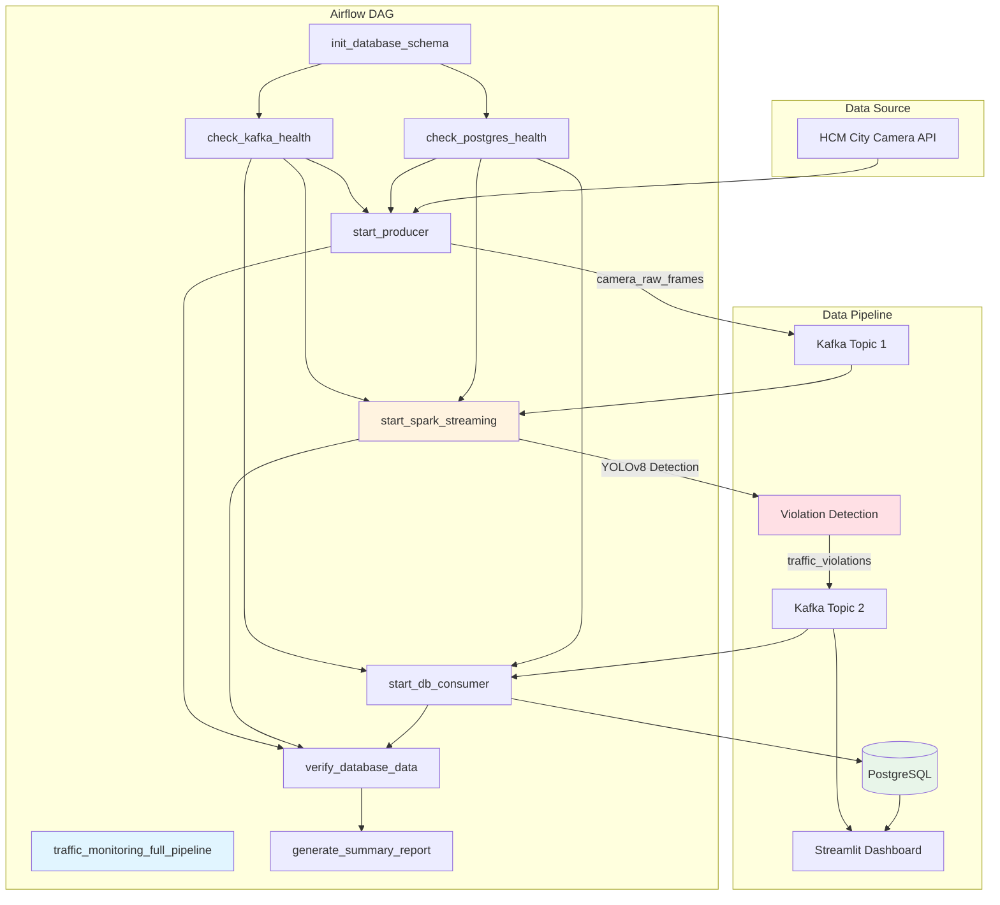

# Real-Time Traffic Violation Monitoring System

Sistema de giám sát vi phạm giao thông thời gian thực sử dụng Apache Airflow, Apache Spark Streaming, Kafka, YOLOv8 và PostgreSQL.

## 📋 Tổng Quan

Hệ thống thu thập hình ảnh từ camera giao thông TP.HCM, phát hiện vi phạm giao thông bằng AI (YOLOv8), lưu trữ vào database và hiển thị real-time trên dashboard.

### Kiến Trúc Tổng Thể



---

## 🔄 Luồng Dữ Liệu (Data Flow)

### 1. Thu Thập Dữ Liệu (Data Collection)

**Producer** (`kafka_producer.py`):

```
HCM City Camera API → HTTP GET → Download Image → Save to Disk → Kafka Message
```

**Message Format:**

```json
{
  "camera_id": "pasteur_le_duan",
  "timestamp": "2025-12-09T14:30:00.123456",
  "image_path": "/opt/airflow/projects/realtime-traffic-monitoring/images/pasteur_le_duan/pasteur_le_duan_20251209_143000.jpg",
  "filename": "pasteur_le_duan_20251209_143000.jpg"
}
```

**Kafka Topic:** `camera_raw_frames`

---

### 2. Phát Hiện Vi Phạm (Violation Detection)

**Spark Streaming Processor** (`spark_processor.py`):

```
Kafka Stream → Parse JSON → YOLO Detection → Violation Logic → Output to Kafka
```

#### Bước 2.1: Object Detection (YOLOv8)

Model: **YOLOv8n** (Nano version)

**Target Classes:**

- `2`: car
- `3`: motorcycle
- `5`: bus
- `7`: truck
- `9`: traffic light

**Output:**

```python
{
  "class_id": 2,
  "class_name": "car",
  "confidence": 0.89,
  "bbox": [150.2, 200.5, 350.8, 450.3],  # [x1, y1, x2, y2]
  "center": [250.5, 325.4]                # [cx, cy]
}
```

#### Bước 2.2: Violation Detection Logic

**ROI Configuration** (`roi.json`):

```json
{
  "pasteur_le_duan": {
    "stop_line": [
      [100, 300],
      [500, 300]
    ],
    "traffic_light_roi": [400, 50, 450, 100]
  }
}
```

**Logic:**

1. Tìm vạch dừng (stop line): `y = stop_y`
2. Tìm phương tiện: `vehicles = [car, motorcycle, bus, truck]`
3. Kiểm tra vi phạm:
   ```python
   if vehicle.center_y > stop_y:
       violation = {
           "type": "stop_line_crossing",
           "vehicle": vehicle.class_name,
           "confidence": vehicle.confidence,
           "position": vehicle.center
       }
   ```

**Output Message:**

```json
{
  "camera_id": "pasteur_le_duan",
  "timestamp": "2025-12-09T14:30:01.456789",
  "image_path": "/opt/airflow/projects/.../pasteur_le_duan_20251209_143000.jpg",
  "violations": [
    {
      "type": "stop_line_crossing",
      "vehicle": "car",
      "confidence": 0.89,
      "position": [250.5, 325.4]
    }
  ]
}
```

**Kafka Topic:** `traffic_violations`

---

### 3. Lưu Trữ (Data Persistence)

**DB Consumer** (`db_consumer.py`):

```
Kafka Consumer → Parse Violations → Batch Insert → PostgreSQL
```

**Database Schema:**

```sql
-- Table: traffic_violations
CREATE TABLE traffic_violations (
    id SERIAL PRIMARY KEY,
    camera_id VARCHAR(100),
    violation_type VARCHAR(100),    -- 'stop_line_crossing', 'red_light_running'
    vehicle_type VARCHAR(50),       -- 'car', 'motorcycle', 'bus', 'truck'
    confidence FLOAT,
    position_x FLOAT,
    position_y FLOAT,
    image_path VARCHAR(500),
    detected_at TIMESTAMP,
    created_at TIMESTAMP DEFAULT CURRENT_TIMESTAMP
);

-- Table: cameras
CREATE TABLE cameras (
    id SERIAL PRIMARY KEY,
    camera_id VARCHAR(100) UNIQUE,
    name VARCHAR(255),
    location VARCHAR(500),
    is_active BOOLEAN DEFAULT TRUE
);

-- Table: detection_summary (hourly aggregation)
CREATE TABLE detection_summary (
    id SERIAL PRIMARY KEY,
    camera_id VARCHAR(100),
    hour_bucket TIMESTAMP,
    total_violations INTEGER,
    violation_breakdown JSONB,
    vehicle_breakdown JSONB
);
```

**Batch Processing:**

- **Batch Size**: 10 messages
- **Timeout**: 5 seconds
- Whichever comes first triggers insert

---

### 4. Hiển Thị (Visualization)

**Streamlit Dashboard** (`dashboard.py`):

**Features:**

1. **Live Camera Feed**
   - Hiển thị ảnh real-time từ topic `camera_raw_frames`
   - Auto-refresh mỗi 30 giây
2. **Violation Alerts**
   - Consume từ topic `traffic_violations`
   - Hiển thị ảnh vi phạm với chi tiết
3. **Metrics**
   - 📸 Frames Received
   - ⚠️ Total Violations
   - 📹 Active Cameras
4. **Violation Log**
   - Table với timestamp, camera, type, vehicle, confidence

**Access:** http://localhost:8501

---

## 🎯 Cơ Chế Cảnh Báo (Alert Mechanism)

### Real-Time Alerts

**1. Dashboard Alerts:**

- Visual highlight khi có vi phạm
- Âm thanh cảnh báo (optional)
- Hiển thị ảnh vi phạm với bounding box

**2. Database Triggers (Future):**

```sql
-- Trigger gửi notification khi có vi phạm mới
CREATE OR REPLACE FUNCTION notify_violation()
RETURNS TRIGGER AS $$
BEGIN
    PERFORM pg_notify('new_violation', row_to_json(NEW)::text);
    RETURN NEW;
END;
$$ LANGUAGE plpgsql;

CREATE TRIGGER violation_alert
AFTER INSERT ON traffic_violations
FOR EACH ROW EXECUTE FUNCTION notify_violation();
```

**3. Email/SMS Alerts (Future Integration):**

- Kafka Connect → External Service
- Airflow Email Operator

---

## 🚀 Airflow DAG Orchestration

**DAG:** `traffic_monitoring_full_pipeline`

### Tasks

| Task                      | Type           | Function                      |
| ------------------------- | -------------- | ----------------------------- |
| `init_database_schema`    | BashOperator   | Run SQL init script           |
| `check_kafka_health`      | PythonOperator | Verify Kafka broker           |
| `check_postgres_health`   | PythonOperator | Verify PostgreSQL             |
| `start_producer`          | BashOperator   | Run kafka_producer.py (5 min) |
| `start_spark_streaming`   | BashOperator   | Submit Spark job (5 min)      |
| `start_db_consumer`       | BashOperator   | Run db_consumer.py (5 min)    |
| `verify_database_data`    | BashOperator   | Query DB for stats            |
| `generate_summary_report` | BashOperator   | Generate final report         |

### Dependencies

```
init_database_schema
    ↓
[check_kafka_health, check_postgres_health]
    ↓
[start_producer, start_spark_streaming, start_db_consumer] (parallel)
    ↓
verify_database_data
    ↓
generate_summary_report
```

**Schedule:** Manual trigger (on-demand)

**Timeout:** 5 minutes per streaming task

---

## 📊 Monitoring & Metrics

### Kafka Topics

```bash
# List topics
docker-compose exec kafka kafka-topics --bootstrap-server localhost:9092 --list

# Consumer camera_raw_frames
docker-compose exec kafka kafka-console-consumer \
  --bootstrap-server localhost:9092 \
  --topic camera_raw_frames \
  --from-beginning

# Consumer traffic_violations
docker-compose exec kafka kafka-console-consumer \
  --bootstrap-server localhost:9092 \
  --topic traffic_violations \
  --from-beginning
```

### Database Queries

```sql
-- Total violations today
SELECT COUNT(*) FROM traffic_violations
WHERE detected_at::date = CURRENT_DATE;

-- Violations by camera
SELECT camera_id, COUNT(*) as total
FROM traffic_violations
GROUP BY camera_id
ORDER BY total DESC;

-- Violations by hour
SELECT DATE_TRUNC('hour', detected_at) as hour, COUNT(*)
FROM traffic_violations
GROUP BY hour
ORDER BY hour DESC;
```

### Spark UI

**Access:** http://localhost:4040 (when Spark job is running)

---

## 🛠️ Cách Chạy Hệ Thống

### 1. Start Infrastructure

```bash
cd c:\Users\LENOVO\Desktop\cardiac_prediction
docker-compose up -d
```

### 2. Trigger DAG

- Access Airflow: http://localhost:8080 (airflow/airflow)
- Navigate to DAGs
- Find `traffic_monitoring_full_pipeline`
- Click trigger (▶️)

### 3. View Dashboard

- Access: http://localhost:8501
- Enable "Show Raw Camera Feed" in sidebar
- Monitor violations in real-time

### 4. Run Mock Producer (Optional)

```bash
# Trong container
docker-compose exec airflow-worker bash -c \
  "cd /opt/airflow/projects/realtime-traffic-monitoring && python mock_producer.py"

# Hoặc trên host (nếu có Python + Kafka)
cd projects\realtime-traffic-monitoring
python mock_producer.py
```

---

## 🔧 Troubleshooting

### Producer không gửi messages

```bash
# Check producer logs
docker-compose logs -f traffic-monitoring-producer

# Check Kafka connectivity
docker-compose exec kafka kafka-topics --bootstrap-server localhost:9092 --list
```

### Spark không detect violations

```bash
# Check Spark logs
docker-compose logs -f airflow-worker | grep -i spark

# Verify YOLO model exists
docker-compose exec airflow-worker ls -lh /opt/airflow/projects/realtime-traffic-monitoring/yolov8n.pt
```

### Dashboard không hiển thị ảnh

1. Check `PermissionError`: Run `chmod -R 777 images/`
2. Check Kafka messages: `kafka-console-consumer --topic camera_raw_frames`
3. Restart Streamlit: `docker-compose restart streamlit-cardiac`

---

## 📈 Performance

| Component       | Throughput               | Latency         |
| --------------- | ------------------------ | --------------- |
| Producer        | 4 cameras @ 10s interval | ~1s per image   |
| Kafka           | 1000+ msg/sec            | <10ms           |
| Spark Streaming | Batch every 5s           | ~2-3s per batch |
| YOLO Inference  | ~30 FPS (CPU)            | ~30ms per frame |
| DB Insert       | Batch of 10              | ~50ms           |
| Dashboard       | Refresh 30s              | Real-time       |

---

## 🔮 Future Enhancements

1. **Advanced Violation Types:**

   - Red light running detection
   - Wrong lane detection
   - Speed estimation
   - License plate recognition (OCR)

2. **ML Improvements:**

   - Fine-tune YOLO on Vietnam traffic
   - Track vehicles across frames
   - Count traffic flow

3. **Scalability:**

   - Multi-worker Spark cluster
   - Kafka partitioning by camera
   - Redis caching for dashboard

4. **Alerts:**
   - Email/SMS notifications
   - Webhook integration
   - Mobile app push notifications

---

## 📚 Tech Stack

| Component        | Technology     | Version |
| ---------------- | -------------- | ------- |
| Orchestration    | Apache Airflow | 2.9.0   |
| Streaming        | Apache Spark   | 3.5.1   |
| Message Queue    | Apache Kafka   | 7.5.0   |
| Database         | PostgreSQL     | 13      |
| Object Detection | YOLOv8         | 8.x     |
| Dashboard        | Streamlit      | Latest  |
| Language         | Python         | 3.12    |
| Container        | Docker Compose | -       |

---

## 👥 Contributors

- **Tu Nguyen** - Initial implementation

## 📄 License

MIT License
